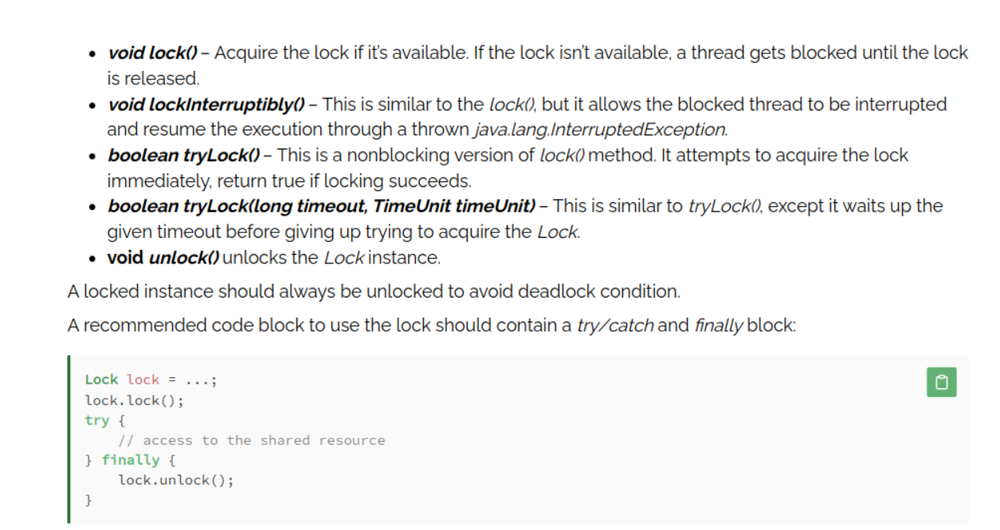
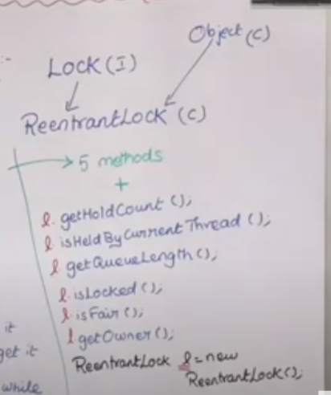

LOCKS

Reentrant Lock
- ReadWrite Lock
Stamped Lock
Semaphore Lock
Condition (await, Signal & SignalAll)
https://www.codeburps.com/post/locks-in-java-multithreading
https://www.baeldung.com/java-concurrent-locks
https://www.youtube.com/watch?v=7VqWkc9o7RM
https://www.youtube.com/watch?v=fZsCG1Z7OBE&t=982s

# Theory of Locks

> Difference between Locks and synchronized

1. A synchronizedblock is fully contained within a method. We can have Lock APIs lock() and unlock() operation in separate methods.
2. A synchronized block doesn’t support the fairness. Any thread can acquire the lock once released, and no preference can be specified. We can achieve fairness within the Lock APIs by specifying the fairness property. It makes sure that the longest waiting thread is given access to the lock.
3. A thread gets blocked if it can’t get an access to the synchronized block. The Lock API provides tryLock() method. The thread acquires lock only if it’s available and not held by any other thread. This reduces blocking time of thread waiting for the lock.
4. A thread that is in “waiting” state to acquire the access to synchronized block can’t be interrupted. The Lock API provides a method lockInterruptibly() that can be used to interrupt the thread when it’s waiting for the lock.

5. The unlock() method of a lock cannot be executed if the method throws an exception. Synchronization works clearly in this case. It releases the lock.

> Lock interface methods : 

Lock interface in Java . ReentrantLock is implementation of this lock interface. ReentrantLock also has side class of object class ,i.e directly inhereting from object class.
Main class is the main thread. If the Lock is called in main () , then we say main thread is having the lock .

*Go to ReentrantDemo.java*

Now the ReentrantCar part.
ReentrantCar is definend how someone tries to performTryLock and how to drive.
ReentrantChildThread has-a ReentrantCar and is-a Thread .
The example is shown in ReentrantMain.java
>Output

Thread1 Who is trying to acquire lock--> Thread1 

Thread2 Who is trying to acquire lock--> Thread2

Thread1 Get Queue --0

Thread1 has Queue --true

Lock acquired by Thread1

Thread1 is driving the car

Thread2 Get Queue --0

Thread2 has Queue --false

Lock could not be acquired by Thread2
> See here Thread2 tries but fails as Already Lock acquiredby Thread1
Run by Thread2

Thread1 is driving the car

Thread1 is driving the car

Thread1 is driving the car

Thread1 is driving the car

Run by Thread1