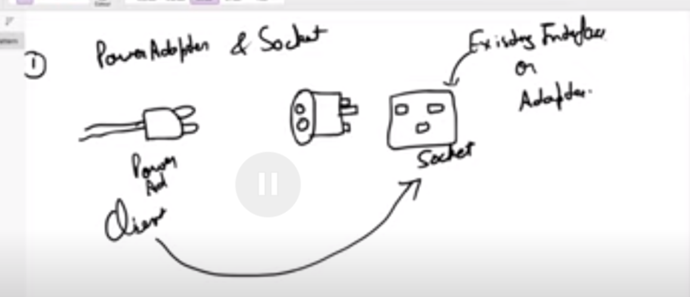

> [Youtube](https://www.youtube.com/watch?v=8wrg7IsILhQ&t=243s)

When Client is not compatable to existing Adaptar .  We make a Adaptar Class , that knows how to communicate bewtween the client and existing .

Here we Clients in main (Babyweight).We gave a baby whose wieight is 10 pounds . But we only understand in kg . 
Weight MAchine understands pounds only . 
So Concrete Adaptor does all the conversions 
We have WeightMachineAdaptar to communicate. Concrete Adaptar communicates both with WeightMachine and WeightMachineAdaptar.