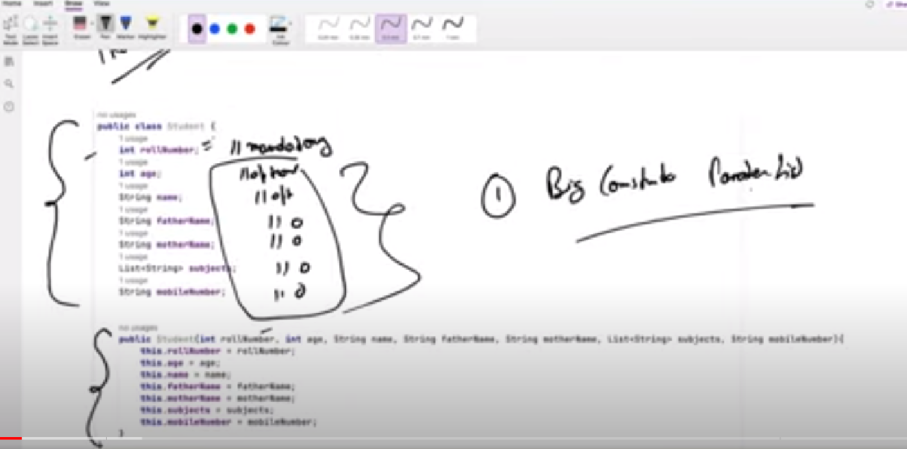
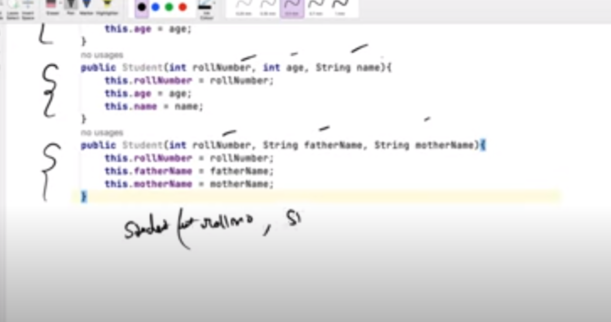
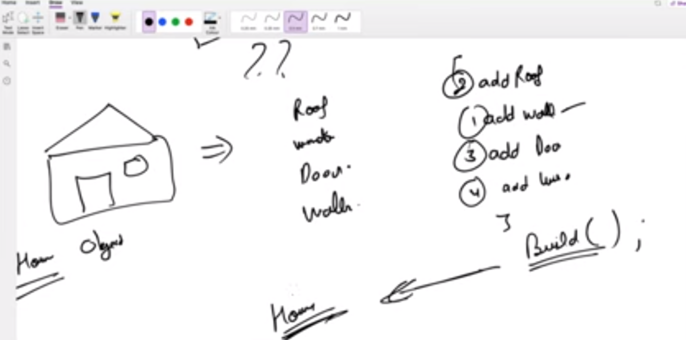

# Builder Design Pattern

> Class Has few mandatory attributes and mostly optional . So Big Construction initialization
 field . [Youtube](https://www.youtube.com/watch?v=qOLRxN5eVC0)

1. Study difference between builder and decorator 
2. Director 

Now Make Small Constructors . But problem lot of permutaiton combinations and lot of unused Constructors  

Also If we try to add another Consturctor Student(int , string,string) 
 
Compilation error .Single Same contructor signature so error 

> Digital OCean Code [link](https://www.digitalocean.com/community/tutorials/builder-design-pattern-in-java)

Step By Step Object Creation in Builder Design . But Code Redundancy for Computer.java as the member variables need to be duplicated once more .
 
> Read about  [static nested classes content-link](https://www.digitalocean.com/community/tutorials/java-inner-class) 

**Student -> ALL member variables are there .Now to intilaize the constructor .IT uses a static nested StudentBuilder . Now StudentBuilder has setter functions to actually setand return this (instance of student built ). Finally after all the methods are called (or what are necessory) .Finally the build(this) -this means the current object . is called to return the Student object to the Student Consturctor**

Certainly! Here's a concise comparison of the Builder and Decorator design patterns:

Builder Pattern
Purpose: Used to construct complex objects step by step.
Type: Creational pattern.
Focus: Separates the construction of a complex object from its representation, allowing different configurations and representations.
Usage: Ideal for creating objects with many optional parameters or configurations.
Structure: Involves a builder class with methods to set the properties of the product and a build method to return the final product.

Decorator Pattern
Purpose: Used to add behavior or responsibilities to objects dynamically.
Type: Structural pattern.
Focus: Enhances or extends the functionality of objects without modifying their structure.
Usage: Suitable for adding features to individual objects, often at runtime, without affecting other instances of the same class.
Structure: Involves a component interface, concrete components, and decorators that wrap these components, adding new behavior.

Summary
Builder is about constructing a complex object step by step, focusing on the creation process.
Decorator is about adding additional behavior or functionality to an existing object dynamically, focusing on the extension of an object's behavior.