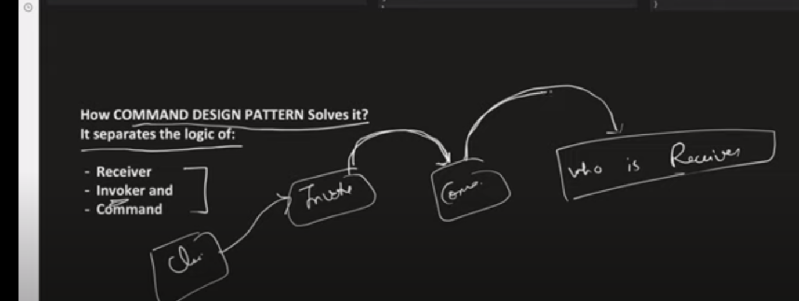

[Yotube](https://www.youtube.com/watch?v=E1lce5CWhE0&t=152s)

Read what problems it solve.

Undo / Redo capability
Client clicks on Command in Invoker(Remote) recieved by Reciever(TV).

CommandInterface has-a relation with Reciever.
ConcreteCommands is-a relation with CommandInterface.
Invoker has-a CommandInterface.
Client interacts with Invoker.

We use stack to push all the commands inorder. then pop while undo.

