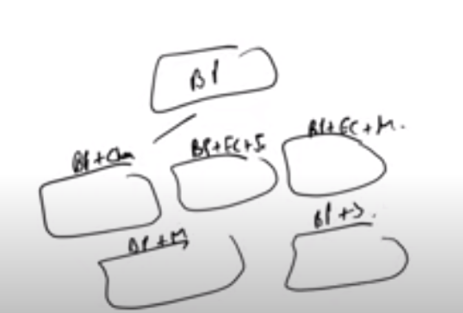
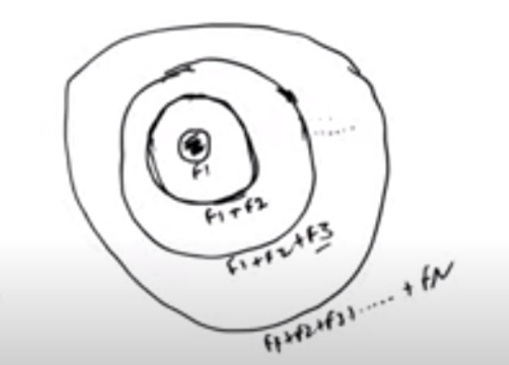
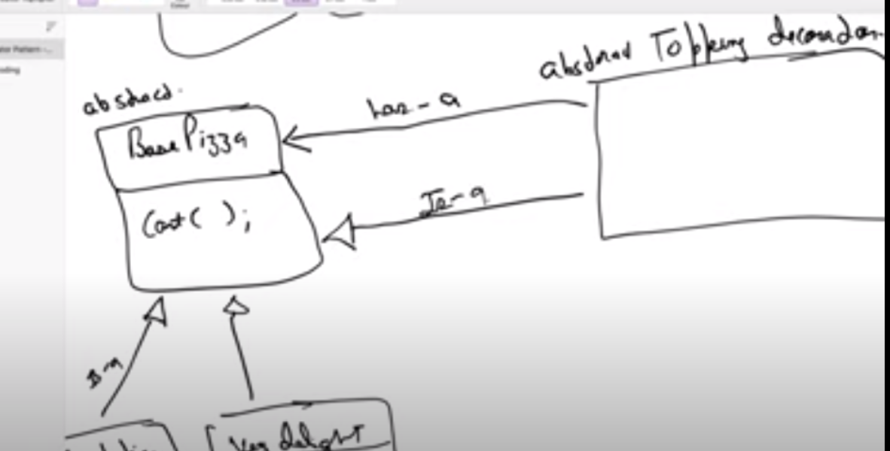
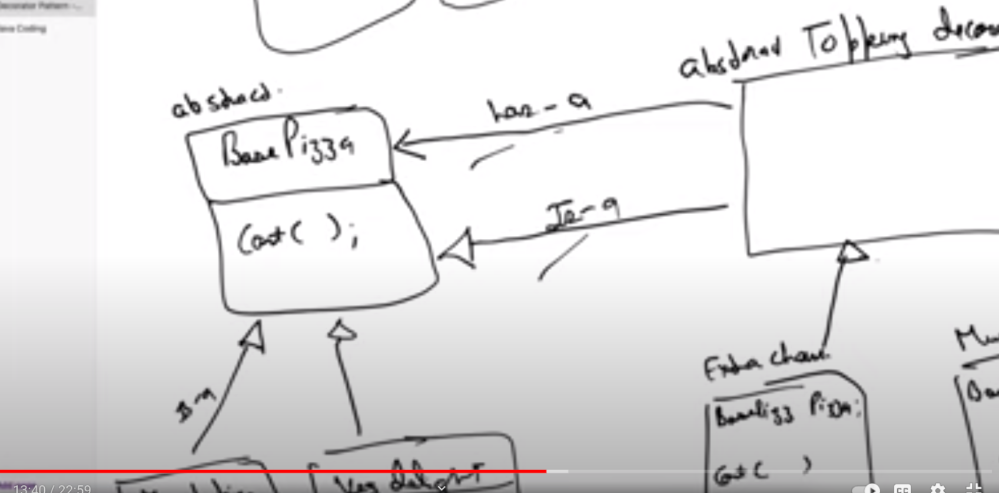

# Decorator Pattern

> Why Do You Need Decorator Pattern ? 

Class Explosation . 
We have a base class. Now more type of topings come in the market ..more permutation compitions

So we Make a base class and then we add separe each toping class.Add on the toping to the base classe 

Abstract Base Pizza class which has Cost( ). So Whoever inherits this base class, will need to implement it also(override). [ veg delight,FarmHouse]

Abstract ToppingDecorator is both **has-a** and **is-a** Base Pizza.
Since It can again be decorated by another Decorator.

Now Extra Cheese , Extra MushRoom classes extend the ToppingDecorator Class . So When they implement the cost = BasePizza.cost + Extra-cost . Since **has-a** relation with base pizza , so they will also have the Base pizza object.

In our Code : 

> Abstract BasePizza is inherited (is-a) with VegDelight and FarmHouse. Abstract Topping Decorator "is-a" and "has-a" BasePizza. So the abstract Methods also needs to be defined by its inheriting classes (ExtraCheese and ExtraMushRoom) 