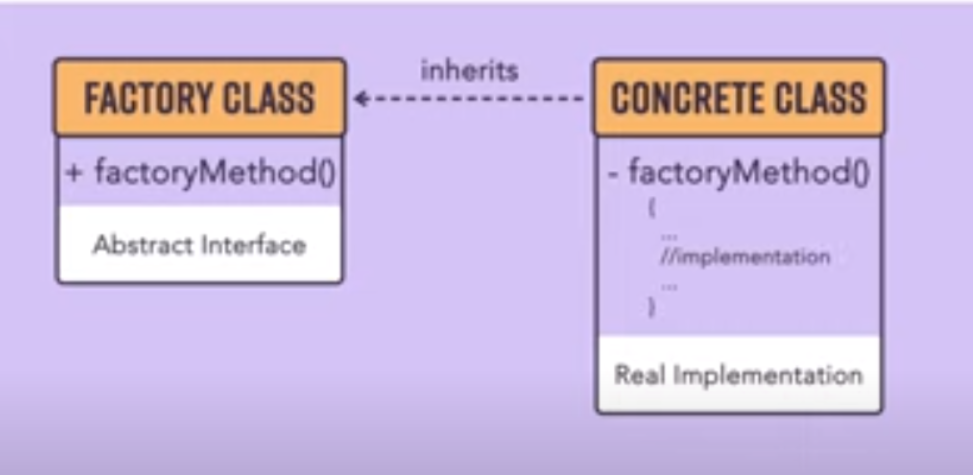
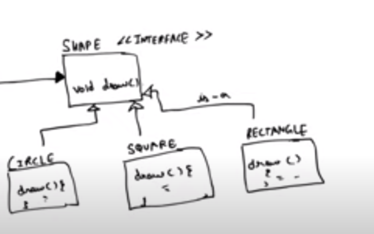

# Factory Method

Client Calls the f1( ) function from Factory Class . Factory class returns the required object.But The actual defination of the classes are implemented in another class known as Concrete class. So basically the Factory Class has the methods (exposed to the client) which are implemented by the Concrete classes in their code base and are hidden from user.

Object Creation on the basis of some condition . 
if Condition 1 gets fulfllied , obj1 will be created ..similarly others

So **When we are creating object on the basis of conditions ,then we use factory method**

ShapeFactory returns the shape object. It accepts parameters as business logic and then based on cases it returns the desired object of shape interface.

>>Benefits
1.Factory design pattern provides approach to code for interface rather than implementation.
2.Factory pattern removes the instantiation of actual implementation classes from client code. Factory pattern makes our code more robust, less coupled and easy to extend. For example, we can easily change PC class implementation because client program is unaware of this.
3.Factory pattern provides abstraction between implementation and client classes through inheritance.

# Abstract Factory pattern

Here We manage factories of factory.

`Vehicle Interface which has 4 classes : 2 Luxuries and 2 Ordinary cars obejct. 
Now Vehicle Factory has two factory Luxury and ordinary Factory which specificly catters to their own two cars Lux Fact(Lux v1,v2) and Ord Fact(Ord v1,v2).
Vehicle Factory returns the vehicle object (Actual Product object).

The Class that Client(main)interacts is lets say Abstract Factory which returns the vehicle factory  object. Write the business logic there`

