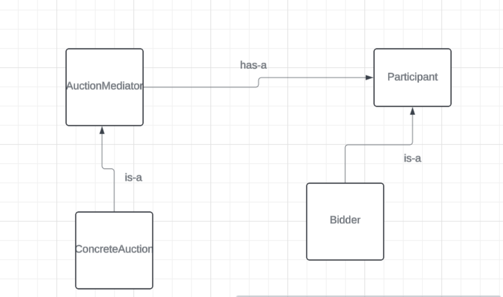
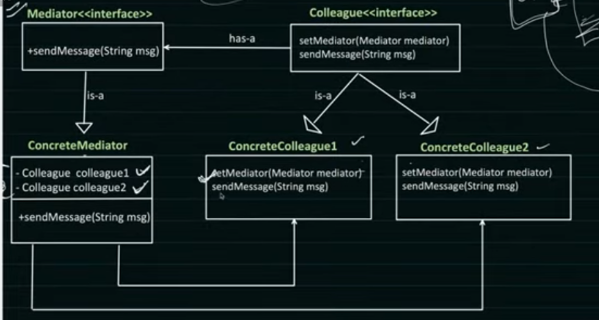

[yotube](https://www.youtube.com/watch?v=bKM2lFPPmmY)

Loose Coupling between two obejcts will communiting . 
The objects donnot direcltly communicatw .they send the message to mediator which then forwards /broadcast/unicast the message to other objects . 

example : aution system . Colleagues==Participants . ConcreteColleges==Bidder

Also Airplane Management system'

2 planes are flying . they want whether the ground is clear for landnign.. they donot communicate with eachther .. they send a landingsafe request to flight controller .
which then checks in radar and then sends a landingsafe signal to that airpalne and a notlandingsafe to other planes who are requesting for landing..to prevent crash
