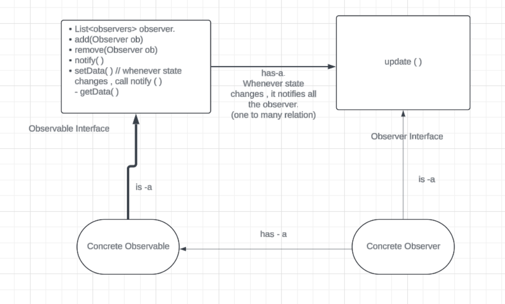

[Gfg](https://geeksforgeeks.org/observer-pattern-set-1-introduction/)
[youtube](https://www.youtube.com/watch?v=Ep9_Zcgst3U)

> Implement Notify me feature . Like in amazon , customers click on notify me when the stock is updated( stock was initially empty )

> for update in observer .
Now two ways : pass the object to be updated in concrete observable and check instanceof  in concrete observer . 
But there are multiple concrete observable . then issue 
Update is what to update () for the customer . 
So if a customer has subscribed observable2 not 1 ..so he must get only for 2 .

So use has a relation from concrete observer to concrete observable 

