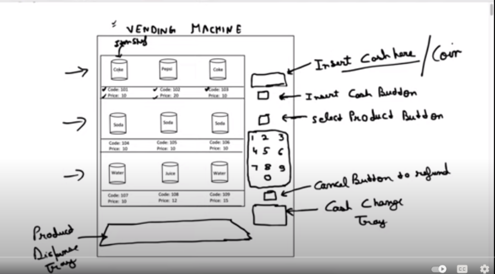
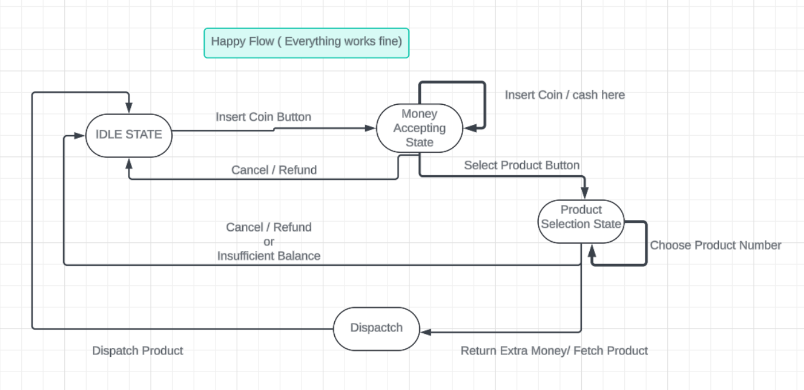
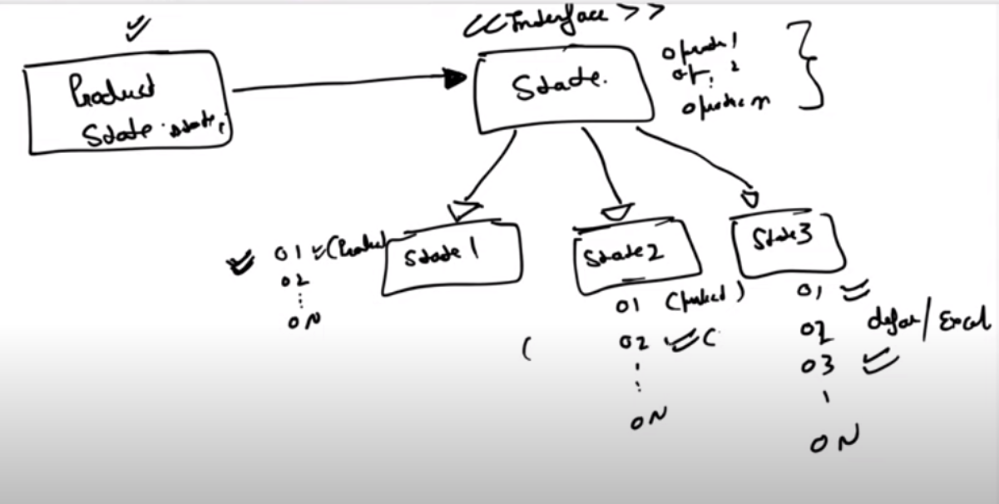
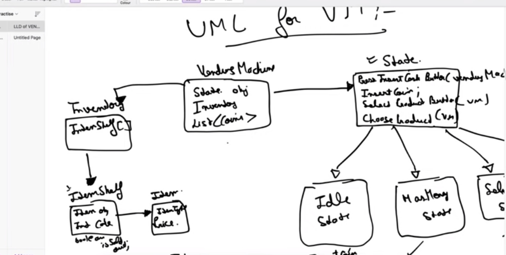

[GFG](https://www.geeksforgeeks.org/state-design-pattern/)

[Youtube](https://www.youtube.com/watch?v=wOXs5Z_z0Ew)

Let say every concrete state i , implements ith operation . Then it must implement it carefully and other states will be default .

