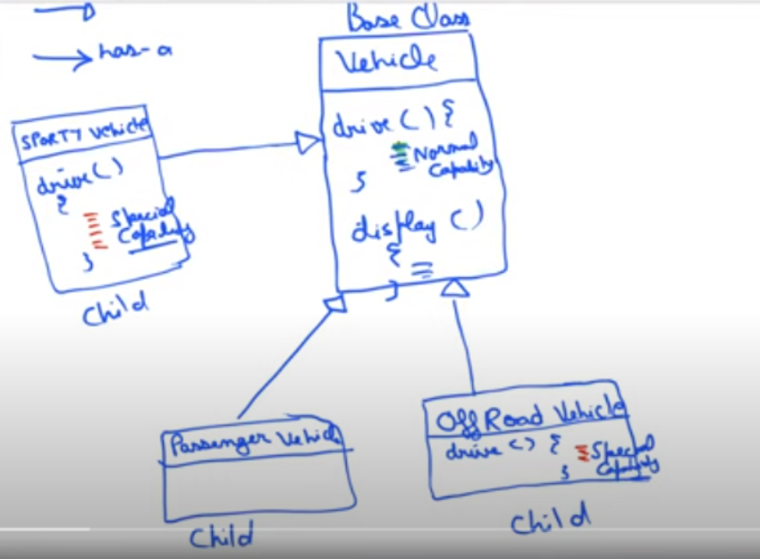
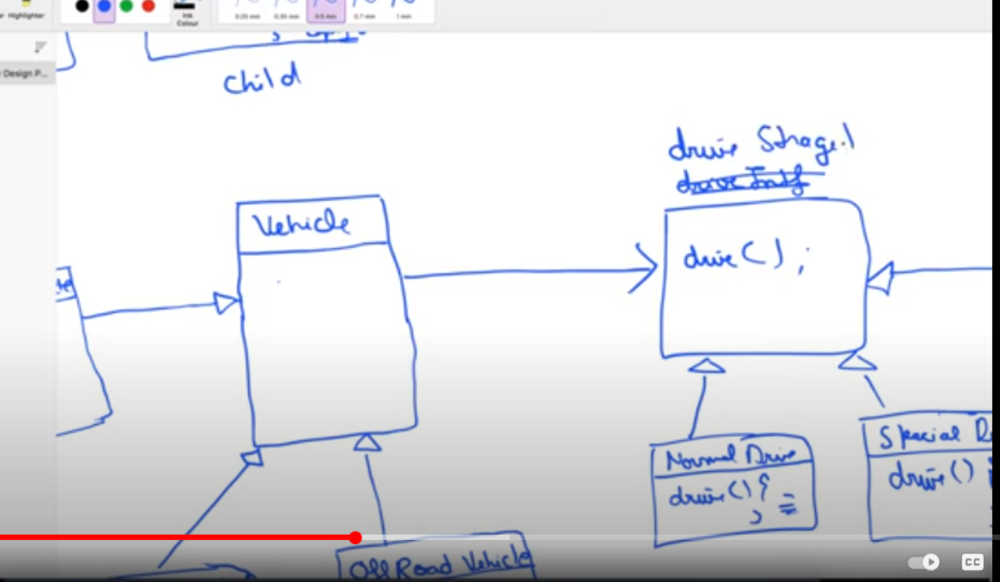

Suppose we have a vehilcle with methods .
Now many class inherit that methods .
IF we see most of the classes have same implementtaion of methods (but not all)
So code duplecacy occurs.
So we have a DriveStrategy interface which has FastDrive,SportyDrive,MilegeDrive methods.
Now say we have a parent class Vehicle which has two childs F1RoadVehicle and OffroadVehicle.
So in Vehicle we are initializing using constructor injection . 
Now in the 2 childresn using super keyword ( for sending the object to the parent constructor for initialing ). Now we use our desired DriveStrategy