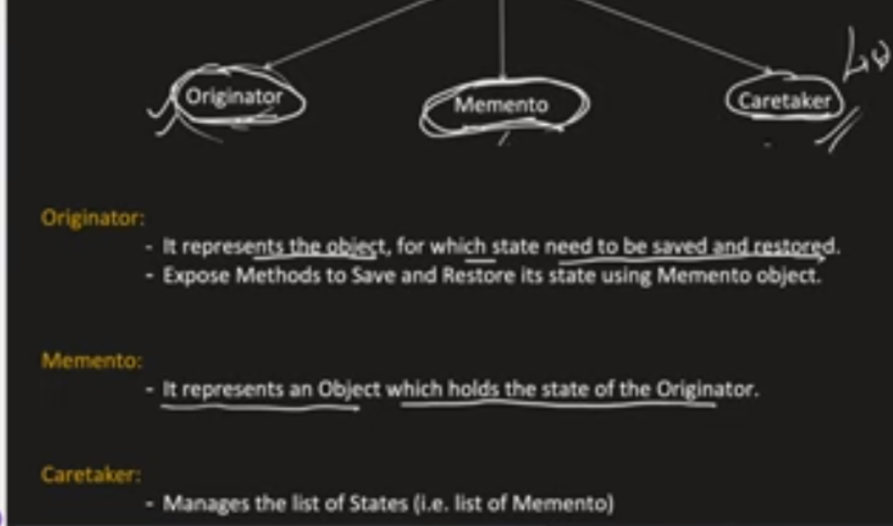
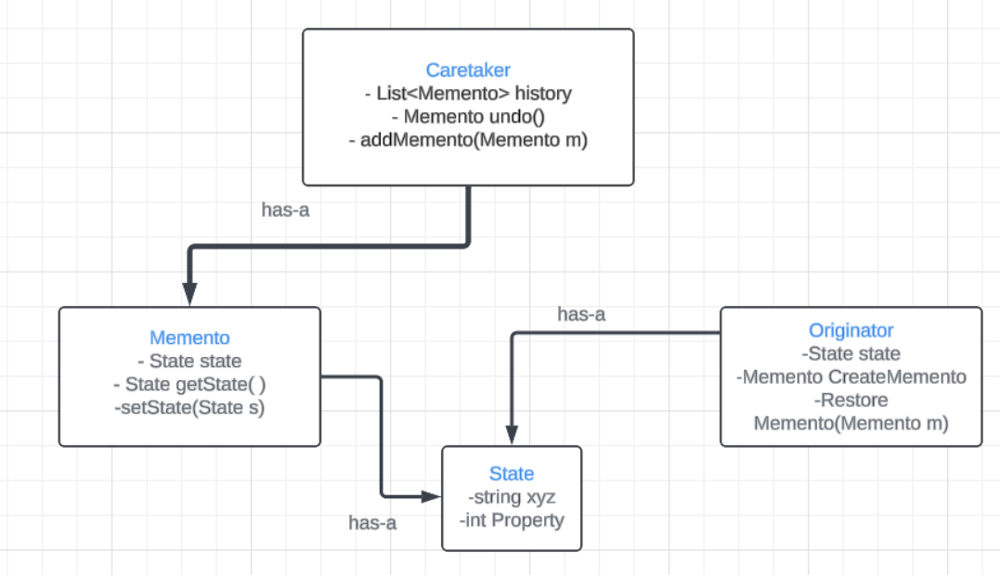

[Youtube](https://www.youtube.com/watch?v=nTo7e2lpGZ4)

storing the history of an object.Provides an ability to revert to previous state of an object 
i.e UNDO function.ALthough it doesnot expose the internal implementation of object

It is also known as SnapShot Design PAttern. to take snapshot of a state and whenever we can revert to snapshot .we can go back

Originator Hides the details of implementation of restoring and creation of memento and exposes the two functions creatememento and restorememento.In RestoreMemento , it gets memento obejct and then it decides what all attributes it needs to go back to previous state. So logic for what to save from memento and what to read from memento is given in Originator.

Memento has the state of the object to be stored.
Caretaker has list of mementoes

