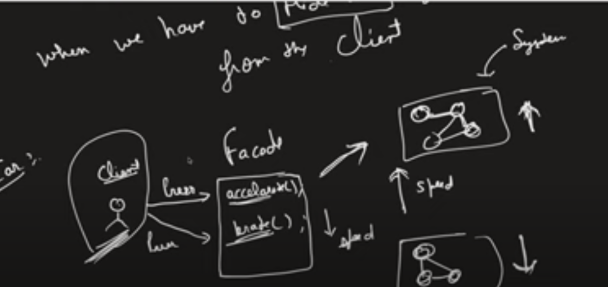

> [YoutubeLink](https://www.youtube.com/watch?v=GYaBXK54eLo&t=147s)
1.Facad of Facad
2.Facad vs Proxy
3.Why we need facad. = if any change in object return type we need to change the client also..so facad takes care of it . client doesnot need to change 
Whenever we have to hide the system complexity from the user , we use Facade Design

In Code . Main interacts only with EmployeeFacad. EmployeeFacad interacts with EmployeeDAO