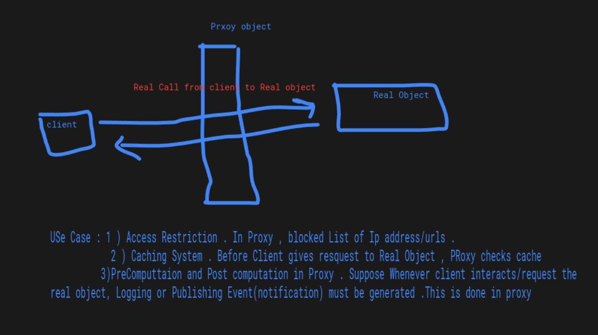

EmployeeTable is interface .
EmployeeTableProxy 'is-a' EmployeeTable and 'has-a' EmployeeTableImplementer(ConcreteEmployee  Concrete class i.e class which gives actual implementation of the EmployeeTable class).
EmployeeTableImplementer 'is-a' EmployeeTable

> [YoutubeLink](https://www.youtube.com/watch?v=9MxHKlVc6ZM&t=231s)

