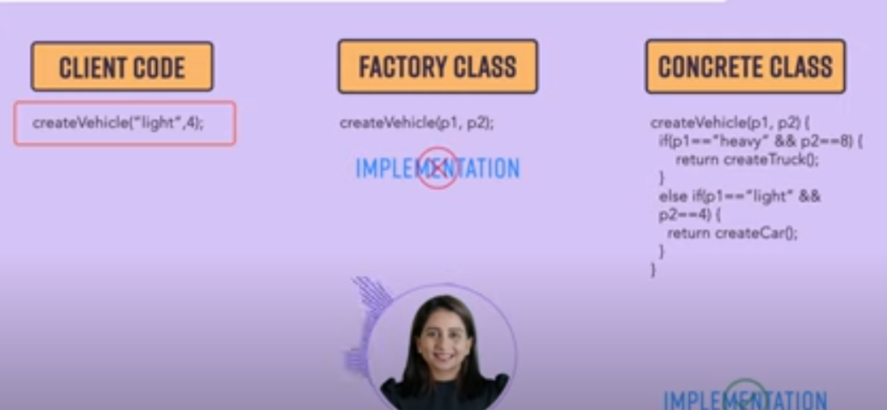
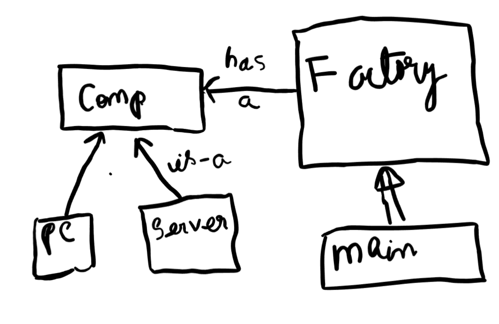

# Factory Method

Client Calls the f1( ) function from Factory Class . Factory class returns the required object.But The actual defination of the classes are implemented in another class known as Concrete class. So basically the Factory Class has the methods (exposed to the client) which are implemented by the Concrete classes in their code base and are hidden from user.

Object Creation on the basis of some condition . 
if Condition 1 gets fulfllied , obj1 will be created ..similarly others

So **When we are creating object on the basis of conditions ,then we use factory method**

ShapeFactory returns the shape object. It accepts parameters as business logic and then based on cases it returns the desired object of shape interface.

>>Benefits
1.Factory design pattern provides approach to code for interface rather than implementation.
2.Factory pattern removes the instantiation of actual implementation classes from client code. Factory pattern makes our code more robust, less coupled and easy to extend. For example, we can easily change PC class implementation because client program is unaware of this.
3.Factory pattern provides abstraction between implementation and client classes through inheritance.

# Abstract Factory pattern

Here We manage factories of factory.
ComputerAbstractFactory returns a Computer Object.
Now  PCFactory and ServerFactory implements the create of ComputerAbstractFactory.

The Abstract Factory Pattern is used to create families of related or dependent objects without specifying their concrete classes. Here's a breakdown of the components in the diagram:

*ComputerAbstractFactory (Interface)*

This is the core interface for creating abstract product objects. It declares methods for creating different types of computers.

*ComputerFactory (Class)*

This class has a reference to ComputerAbstractFactory and uses it to create objects. This can be considered as the client code that uses the abstract factory to create objects without knowing their specific types.

*PCFactory (Class)*

This concrete factory class implements the ComputerAbstractFactory interface and is responsible for creating PC (Personal Computer) objects. It overrides the creation methods to instantiate and return PC objects.

*ServerFactory (Class)*

Similar to PCFactory, this concrete factory class also implements the ComputerAbstractFactory interface and is responsible for creating Server objects. It overrides the creation methods to instantiate and return Server objects.

*Computer (Abstract Class)*

This abstract class represents the product that the factories will create. It defines common properties and methods that all computers should have. Concrete products will inherit from this class.

*PC (Class)*

This class extends the Computer class and represents a specific type of computer, in this case, a personal computer. It provides implementations for the abstract methods defined in the Computer class.

*Server (Class)*

This class also extends the Computer class and represents a specific type of computer, in this case, a server. It provides implementations for the abstract methods defined in the Computer class.

Relationships:
ComputerAbstractFactory is implemented by PCFactory and ServerFactory

PCFactory and ServerFactory are concrete implementations of the ComputerAbstractFactory interface. They provide specific implementations for creating PC and Server objects, respectively.
ComputerFactory depends on ComputerAbstractFactory

ComputerFactory uses the ComputerAbstractFactory interface to create computer objects. This allows the client to create families of related objects without knowing their concrete classes.
PC and Server extend Computer

PC and Server are concrete subclasses of the abstract Computer class. They inherit common properties and methods from the Computer class and provide specific implementations for their respective types.
Flow:
The client code (represented by ComputerFactory) will use the ComputerAbstractFactory interface to get a concrete factory (either PCFactory or ServerFactory).
Depending on the concrete factory, the client will call the factory's methods to create the appropriate type of Computer (either PC or Server).
The PCFactory will create and return PC objects, while the ServerFactory will create and return Server objects.
The client code interacts with the abstract Computer class, allowing it to work with any computer type without depending on their specific implementations.

`Vehicle Interface which has 4 classes : 2 Luxuries and 2 Ordinary cars obejct. 
Now Vehicle Factory has two factory Luxury and ordinary Factory which specificly catters to their own two cars Lux Fact(Lux v1,v2) and Ord Fact(Ord v1,v2).
Vehicle Factory returns the vehicle object (Actual Product object).

The Class that Client(main)interacts is lets say Abstract Factory which returns the vehicle factory  object. Write the business logic there`

